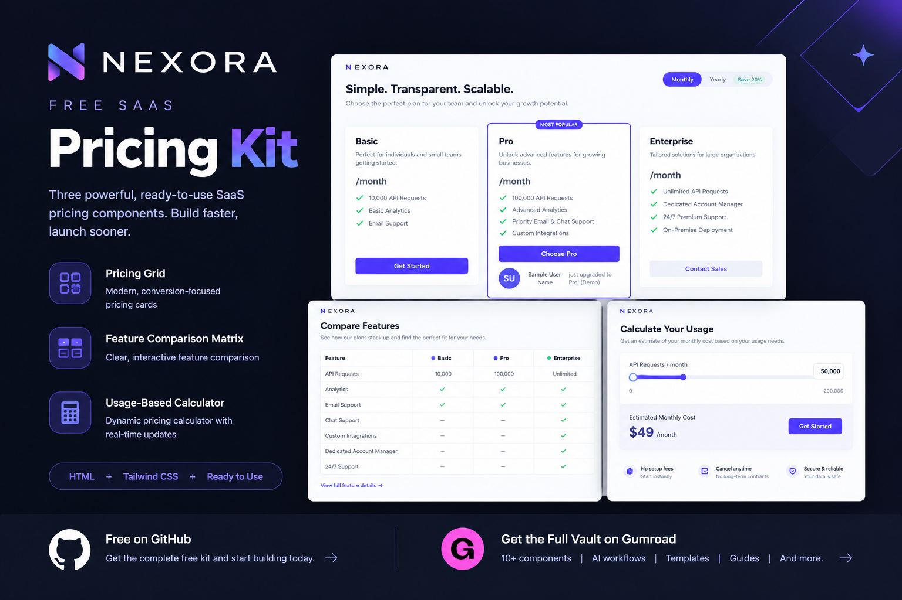
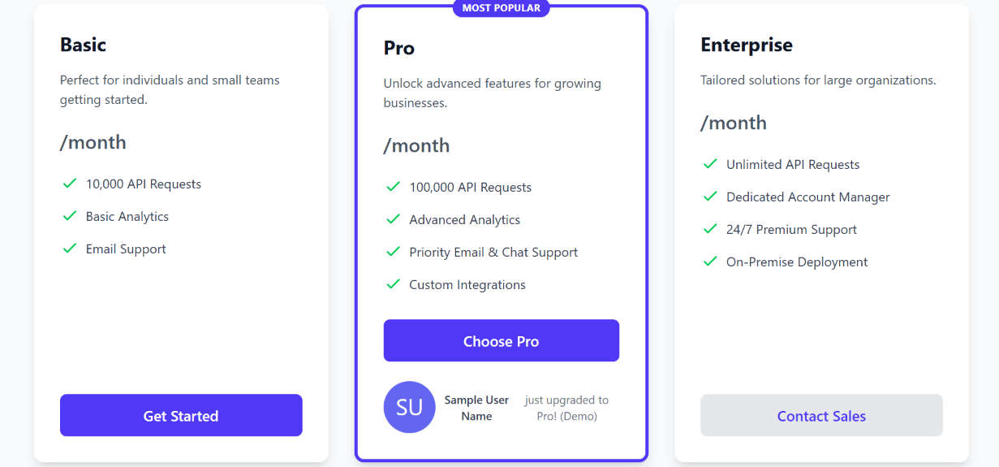
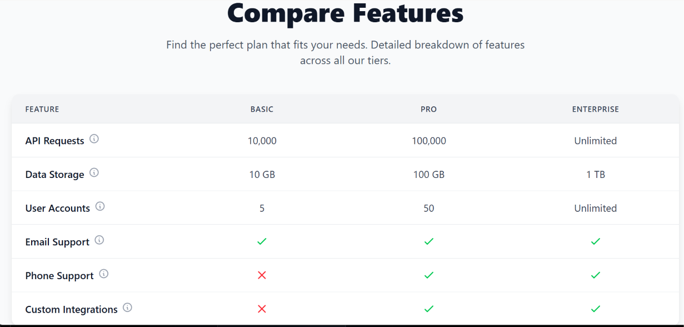
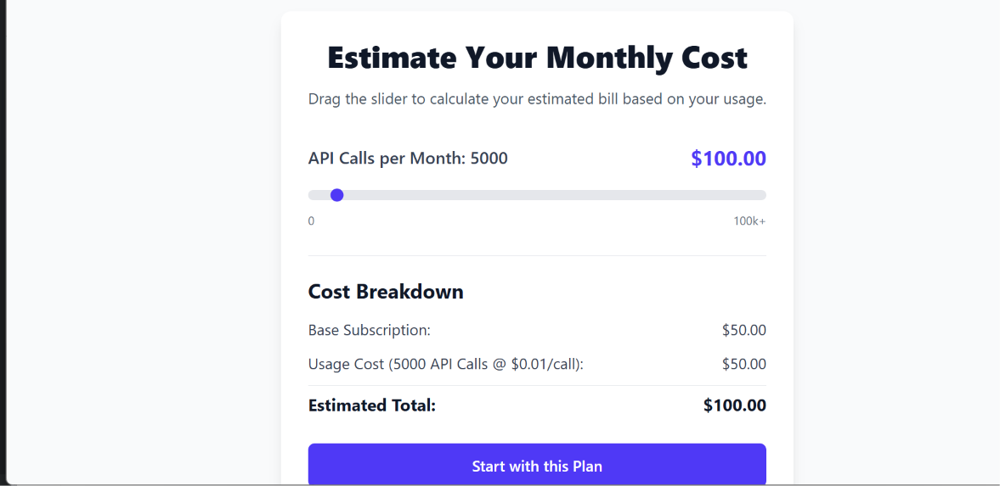

# Nexora Free SaaS Pricing Kit

> **Build better SaaS pricing experiences without starting from scratch.**

**Nexora Free SaaS Pricing Kit** is a free collection of practical SaaS pricing UI components built with **HTML and Tailwind CSS**.

Explore, customize, and integrate modern pricing experiences into your own SaaS projects.

**Nexora is a product brand by Growth Finetouch.**

---

## 🚀 Explore the Free Kit

### 🌐 [Open the Live Demo →](https://growthfinetouch-afk.github.io/Nexora-free-saas-pricing-kit/)

Explore the components directly in your browser.

**Free to explore • No signup required**

---

## ✨ What's Included

The free kit includes **3 practical SaaS pricing components** designed for modern product experiences.

### 💳 Gamified Pricing Grid

An engaging pricing experience designed to make plan selection clearer and more interactive.

**[→ Try the Pricing Grid](gamified_pricing_grid.html)**

---

### 📊 Interactive Feature Comparison Matrix

A structured comparison experience that helps users understand the differences between SaaS pricing plans.

**[→ Try the Feature Comparison](interactive_feature_comparison_matrix.html)**

---

### 🎚️ Usage-Based Slider Pricing Calculator

An interactive calculator designed for SaaS products using usage-based or variable pricing models.

**[→ Try the Usage Calculator](usage_based_slider_pricing_calculator.html)**

---

# 👀 Preview

## Full Preview



---

## 💳 Pricing Grid



Create a modern pricing experience that helps users compare plans and make decisions more easily.

**[→ Open Pricing Grid](gamified_pricing_grid.html)**

---

## 📊 Feature Comparison Matrix



Make complex SaaS plan differences easier to understand with an interactive comparison experience.

**[→ Open Feature Comparison](interactive_feature_comparison_matrix.html)**

---

## 🎚️ Usage-Based Pricing Calculator



Give users a simple way to understand how pricing changes based on usage.

**[→ Open Usage Calculator](usage_based_slider_pricing_calculator.html)**

---

# 🛠️ How to Use

Getting started is simple.

### 1. Clone the repository

```bash
git clone https://github.com/growthfinetouch-afk/Nexora-free-saas-pricing-kit.git
